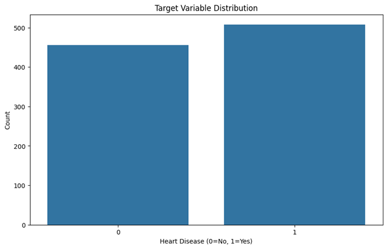
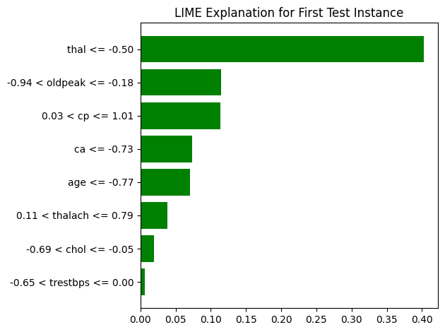
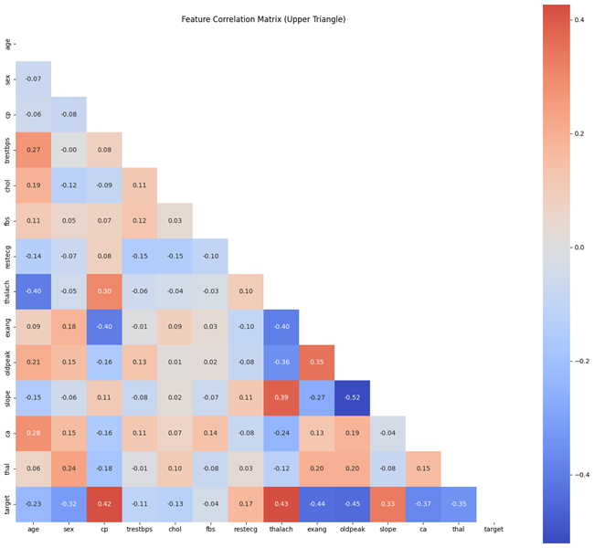
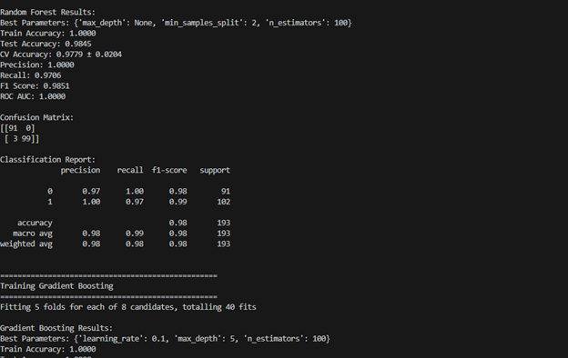
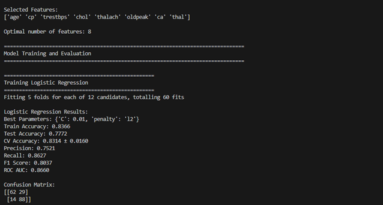

# 🫀 Explainable AI for Machine Learning Heart Disease Prediction

Welcome! This project demonstrates how advanced machine learning and explainable AI (XAI) techniques can predict the risk of heart disease and explain the “why” behind every prediction.

---

## 🚀 Overview

We combine robust ML models (Random Forest, XGBoost, SVM, Neural Network, etc.) with explainability tools like **SHAP** and **LIME** to deliver **trustworthy predictions** and actionable insights for clinical decision-making.

---

## 📊 Dataset

- **Source:** [UCI Heart Disease Dataset](https://archive.ics.uci.edu/ml/datasets/heart+Disease)
- **Files:** `heart.csv`, `heart_cleaned.csv`
- **Target:** Binary variable (`target`)—0 = No heart disease, 1 = Heart disease

---

## 🛠️ Workflow

1. **Data Loading & Exploration**
   - Check for missing values and explore data distribution

2. **Preprocessing**
   - Feature scaling using StandardScaler
   - Class balancing using SMOTE
   - Correlation analysis

3. **Model Training & Evaluation**
   - Train six models and compare their accuracy, precision, recall, and F1-score

4. **Explainability**
   - **SHAP** for global and local feature importance
   - **LIME** for individual prediction explanations

5. **Model Export**
   - The best model is saved as `best_heart_disease_model.joblib`

---

## 🏆 Example Results

- **Random Forest:**  
  - Test Accuracy: ~0.95  
  - Precision: 1.00  
  - Recall: 0.98  
  - F1 Score: 0.99  

---

## 🧑‍💻 Key Features

- **Multiple ML Models:** Logistic Regression, Random Forest, XGBoost, SVM, Neural Network, etc.
- **Automated Model Comparison:** Compare all key metrics at a glance
- **Explainable AI:**  
  - **SHAP:** Understand global and per-patient feature impacts  
  - **LIME:** Dive into local explanations for individual cases  
- **Visual Outputs:**  
  - Target variable distribution, correlation heatmaps, model results, and XAI visualizations

---

## 📂 Files

- `heartmodel.py` — End-to-end pipeline: data prep, training, explainability
- `heart_cleaned.csv`, `heart.csv` — Clean and raw data
- `best_heart_disease_model.joblib` — Trained model
- Visuals:  
  - `target_distribution.png`  
  - `feature_correlation_matrix.png`  
  - `lime_explanation.png`  
  - `model_results1.png`, `model_results2.png`  
  (Rename as appropriate!)

---

## 📦 How To Run

1. **Install dependencies:**
    ```bash
    pip install -r requirements.txt
    ```

2. **Run the pipeline:**
    ```bash
    python heartmodel.py
    ```

3. **Explore outputs:**  
   - Terminal shows accuracy, precision, recall, F1, confusion matrix, and classification report  
   - Generated plots for model results, feature importances, and XAI visualizations

---

## 📬 Contact

Questions or suggestions?  
Open an issue or email [abhisheksanchula@gmail.com](mailto:abhisheksanchula@gmail.com)

---

*Empowering data-driven heart health with transparent, explainable AI!*

---

## 📸 Visual Outputs

> **Below are the main outputs from the project—add them to your repo and link here:**

### 1. Target Variable Distribution


### 2. LIME Explanation for First Test Instance


### 3. Feature Correlation Matrix


### 4. Sample Model Results (Random Forest)


### 5. Sample Model Results (Logistic Regression)

